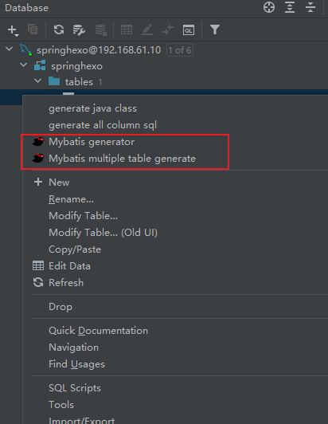

## 前端开发环境搭建

### 安装 Node.js

## 后端开发环境搭建

### MySQL 安装

```shell
docker run -it -d --name mysql_1 -p 7001:3306 \
    -m 400m -v /root/apps/mysql_1/data:/var/lib/mysql \
    -v /root/apps/mysql_1/config:/etc/mysql/conf.d \
    -e MYSQL_ROOT_PASSWORD=123456 \
    -e TZ=Asia/Shanghai --privileged=true \
    mysql:5.7 \
   --lower_case_table_names=1

# 开启自启动
docker update --restart=always mysql_1
```

```

配置文件my.cnf

```ini
[mysqld]
# 数据库字符集
character_set_server = utf8
# MySQL编号（只可以是数字）
server_id = 1

# 开启binlog日志，规定日志文件名称
log_bin = mysql_bin
# 开启relaylog日志，规定日志文件名称
relay_log = relay_bin
# 从库的写操作是否写入binlog日志
log-slave-updates = 1
# 采用严格的SQL语句模式
sql_mode = NO_ENGINE_SUBSTITUTION,STRICT_TRANS_TABLES
```


## mybatiss生成工具

1. 安装插件 mybatix 等工具

2. IDEA连接Database后，右键表生成Entity Mapper

   

